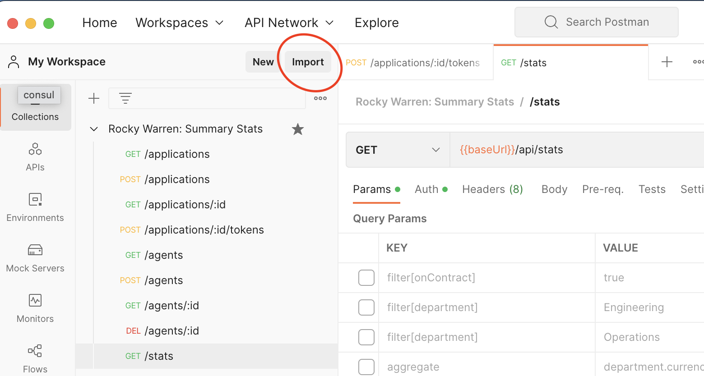

# Salary stats

## Getting started

```bash
# Install dependencies
npm install

# Start the database and API
docker-compose up

# Migrate the database
npx prisma migrate dev

# Seed the database
npx prisma db seed

# Run the unit and integration tests
npm run test
```

## Using the REST API

The API is RESTful and loosely follows the [JSON:API](https://jsonapi.org/) specification. All resources are plural. You `POST` `/:resources` to create a new one, `GET` `/:resources` to get a list, `GET` `/:resources/:id` to get one, and `DELETE` `/:resources/:id` to delete one.

One dummy application is created by default with ID `1` and secret `secret`.

Nine dummy agents are created by default with IDs `1`-`9`.

**Note**: Requests tend to be slow the first time you run them since NextJS has to compile the TypeScript code. Subsequent requests are much faster.

For your convenience, I've included a Postman collection and Postman environment in the `/postman` directory. To use it,

1. Import the collection and environment into Postman using the **Import** button, .
1. Start the app using the [Getting Started](#getting-started) steps.
1. Switch to the `summary-stats-local` environment.
1. Go to the `/applications/:id/tokens` request and click `Send`. The URL and body are configured with the dummy application ID and secret and a Postman test automatically sets the `token` variable in the `summary-stats-local` environment.
1. Run any of the other requests that require a token and they should work out of the box. The token expires after 30 minutes. Once it does, just re-run the step above to set a new one.

### `/api/applications`

- `GET [requires token]`: Get all applications. Secrets are not returned since they should be kept private.
- `POST`: Create a new application.
  - Body:
    - `key: String` (required): The application key. In production, this would likely be generated.
    - `secret: String` (required): The application secret. In production, this would likely be generated. For security, the `secret` is hashed with a 64-byte salt using [`Argon2`](https://en.wikipedia.org/wiki/Argon2) prior to storage and is never returned to the client.

### `/api/applications/:id`

- `GET [requires token]`: Get an application by ID.

### `/api/applications/:id/tokens`

- `POST`: Create a new authentication token. **Tokens expire after 30 minutes.**
  - Body:
    `secret: String` (required): The same value used when creating the application.

### `/api/agents`

- `GET [requires token]`: Get all agents. Secrets are not returned since they should be kept private.
- `POST [requires token]`: Create a new agent
  - Body:
    - `name: String` (required): The agent's full name.
    - `salary: String` (required): The agent's salary.
    - `currency: String` (required): The agent's [ISO 4217 currency code](https://en.wikipedia.org/wiki/ISO_4217).
    - `department: String` (required): The agent's department.
    - `subDepartment: String` (required): The agent's subDepartment.
    - `onContract: Boolean` (default: false): Whether the agent is on contract or not.

### `/api/applications/:id`

- `GET [requires token]`: Get an agent by ID.
- `DELETE [requires token]`: Delete an agent by ID.

### `/api/stats`

- `GET [requires token]`: Calculate summary statistics `min`, `max`, and `avg` across the `agents` dataset.
  - Query parameters:
    - `filter[onContract]: Boolean` (optional): Filters the dataset by `onContract` prior to calculating stats.
      - Examples
        - `/api/stats?filter[onContract]=true`.
    - `filter[department]: String` (optional): Filters the dataset by `department` prior to calculating stats. Include this multiple times to filter by more than one department.
      - Examples
        - `/api/stats?filter[department]=Engineering&filter[department]=Operations`.
    - `aggregate: String` (optional): Aggregates the dataset over the given value. Allows for nested aggregations by dot separating values.
      - Allowed values: `currency`, `department`, `subDepartment`
      - Examples
        - `/api/stats?aggregate=currency`
        - `/api/stats?aggregate=department.subDepartment`
        - `/api/stats?aggregate=department.currency`
    - `calculationField: String` (optional): The numeric field to calculate stats over. Defaults to `salary` since it's the only numeric field.
      - Allowed values: `salary`
      - Examples
        - `/api/stats?calculationField=salary`
    - `currency`: String (optional): The currency to convert each `calculationField` to prior to calculating stats.
      - Allowed values: `EUR`, `INR`, `USD`
      - Examples
        - `/api/stats?currency=INR`

## Decisions

### Language

Based on Clipboard Health's tech stack, the front and backends are in TypeScript, which happens to be my preferred language. In my opinion, it strikes a great balance of type safety and developer productivity that's difficult for other mainstream languages to match. Additionally, using it on both the front an backends allows for more code sharing across the organization and reduces security attack surface.

### Database and ORM

I almost used SQLite for simplicity, but chose PostgresSQL both because Clipboard Health uses it, I've been using it for years and enjoy it, and wanted to mirror what I'd likely use in production.

For an ORM, I chose Prisma. I've used it before, but never in a production capacity so it was a good learning experience for me. Where performance is a concern, I typically write the SQL myself, but Prisma seemed like a good place to start for it's developer experience, type safety, and [schema evolution](https://www.prisma.io/docs/getting-started/setup-prisma/add-to-existing-project/relational-databases/evolve-your-schema-typescript-postgres). If query performance became an issue, you can always use Prisma's [raw database access](https://www.prisma.io/docs/concepts/components/prisma-client/raw-database-access) as needed.

As the dataset grows and depending on the access patterns, an in-memory solution like Redis may be in order to reduce database access. However, I'd wait until that became a problem before implementing it.

### Framework and tools

I chose NextJS because I'm familiar with it and, again, noticed Clipboard Health uses it, at least for frontend projects. I wasn't able to find good benchmarks of NextJS vs frameworks like Express or Fastify that are specifically tailored toward APIs, the latter of which is specifically concerned with high request throughput. However, the bottleneck of this particular app is more likely to be database access as the dataset grows.

One nice-to-have that NextJS lacks is a community of middleware. For instance, specifying which endpoints are token-protected vs public is ad-hoc in my solution, but can be easily configured globally in, for example, Express. This would prevent forgetting to check the token in an endpoint and accidentally deploying it publicly.

I chose industry-standard Prettier for code formatting and ESLint for static analysis.

### Validation

I chose `Zod` for request validation parsing. It's overboard for a project of this size, but I wanted to demonstrate my familiarity with it, experiment with its Prisma generator, and like how it can help keep error messaging consistent across the API.

### Security

Security is important, even for internal APIs. In a real-world scenario, each microservice wouldn't be responsible for storing passwords; there would be a dedicated service for it. However, I wanted to demonstrate password storage. I used recommended guidance from [OWASP](https://cheatsheetseries.owasp.org/cheatsheets/Password_Storage_Cheat_Sheet.html), [this article](https://soatok.blog/2022/12/29/what-we-do-in-the-etc-shadow-cryptography-with-passwords/), and [this article](https://latacora.micro.blog/2018/04/03/cryptographic-right-answers.html) to settle on `Argon2id` (which salts by default), a memory cost of 64 MiB, a time cost of 3, and parallelism of 1.

I chose JWTs for access tokens with a 30 minute expiration. There are tradeoffs to any approach. You cannot immediately revoke JWTs, for instance, they're valid until the expiration. But this seemed like a reasonable approach for this situation.

Secrets are only transmitted in request bodies, not URLs. This ensures that, assuming this is deployed using HTTPS, secrets are encrypted in-transit. Plaintext secrets aren't retained, only the hashes, and the hashes aren't returned in `GET` call responses.

### Architecture and project structure

I didn't want to go too overboard, but did want to limit the places certain libraries are used to prevent lock-in. If this was a concern, looking into ESLint rules to prevent certain dependencies in certain places would be a good idea.

Prisma and Zod aren't referenced in `src/pages`, only in designated areas in `src/lib`. NextJS dependencies are required in `src/pages`, but are only referenced in the `src/lib/api` directory.

As mentioned above, I loosely follows the [JSON:API](https://jsonapi.org/) specification for API structure. Strictly following the spec is powerful, but adds a noise to such a simple API. [Here's an example](https://docs.vertexvis.com/) of an API I built strictly following the spec, however.

### Misc

I achieved 100% test coverage by using mostly integration tests and using unit tests only for logic heavy bits of code that would be cumbersome to test with integration tests. In my experience, this type of testing takes less time, provides better coverage of the code, and is closer to how the code actually executes in production. I wouldn't recommend 100% coverage (there were two lines that would have been cumbersome to add tests for so I cheated and added an ignore comment with an explanation for each). In most cases, in my opinion, anything over 80% is solid.

Exchange rates are hard-coded. In production, these would be fetched from a reliable API.

The statistics are calculated in a code because of the currency conversion. If the dataset didn't contain currency data and there were performance concerns, these calculations could be pushed to the database for likely performance gains. The code does the calculations in a single pass, however, and only requires another pass through each aggregate field, if provided, so I expect this to scale reasonably as the dataset grows.

Latency is going to vary greatly depending on the server used to host the API, how close it is to expected users, the expected size of the dataset, etc. I would wait until those considerations were discussed before investing time in benchmarking.
